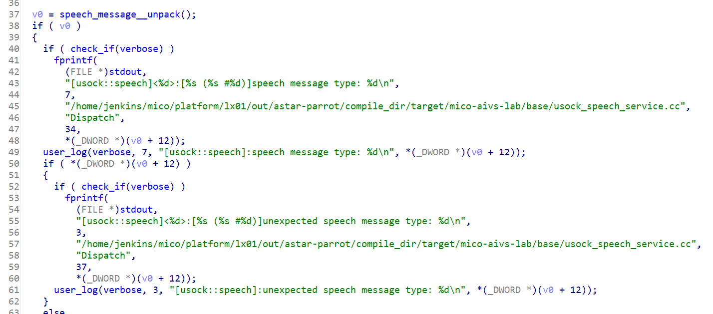

# 小爱音箱mini 默认运行的一些服务

内置的 `ps` 命令可以查看所有运行的进程 (内置的busybox被精简的很简陋, 缺少很多参数支持, 不满意的话可以自己重新编译一个busybox)

和 `小爱同学` 功能有关的

注: 想更加详细的了解一个服务的具体功能, 参考[如何逆向](./reverse-engineering.md)

## 1. mipns-sai

这个进程可以看作是语音命令的入口, 它负责管理录音设备和播放设备, 可以比作耳朵和嘴, 大致的流程是

```mermaid
graph LR
A[录音监听] -- 人声识别 --> B((关键词唤醒))
B -- 录音 --> C{云服务}
C --> D[执行命令, 比如开灯/播放音乐]
C --> E[人声响应, 回答问题]
```

它是 /etc/init.d/pns 负责启动的, 启动脚本看起来是要支持各种不同的型号, 和小爱音箱mini有关的就下面一部分

```sh

# 准备好配置文件, 因为 mipns-sai 还需要往配置文件目录写东西, 所以就把不用动的配置文件软链了一份到了 /tmp
_start_mipns_soundai_prepare() {    
    local model=$(micocfg_model)    
    if [ 'LX01' = $model -o 'LX05A' = $model ]; then    
        if [ -d /tmp/mipns/soundai/config/ ]; then    
            rm -rf /tmp/mipns/soundai/config/*    
        else    
            mkdir -p /tmp/mipns/soundai/config/    
        fi    
        cp /usr/share/sai/sai_config.txt* /tmp/mipns/soundai/config/    
        cp /usr/share/sai/saires_midot.txt /tmp/mipns/soundai/config/    
        ln -s /usr/share/sai/saires_midot.q /tmp/mipns/soundai/config/saires_midot.q    
        ln -s /usr/share/sai/saires_midot2.q /tmp/mipns/soundai/config/saires_midot2.q    
        ln -s /usr/share/sai/saivad.q /tmp/mipns/soundai/config/saivad.q    
        ln -s /usr/share/sai/saicfg.q /tmp/mipns/soundai/config/saicfg.q    
        ln -s /usr/share/sai/wopt_4mic_midot.bin /tmp/mipns/soundai/config/wopt_4mic_midot.bin    
        SAI_CONFIG_PATH="/tmp/mipns/soundai/config"    
    fi    
} 

# 走的是 procd_set_param command /usr/bin/mipns-sai -c $SAI_CONFIG_PATH -l
_start_mipns_soundai() {    
    local voip_status=$(/usr/bin/voip_helper -e query)    
    _start_mipns_soundai_prepare    
    procd_open_instance    
    if [ $VOIP_STATUS_IDLE != $voip_status -o "$VOIP_FLAG" == "voip" ]; then    
        if [ 'local' = $SAI_VAD_MODE ]; then    
            procd_set_param command /usr/bin/mipns-sai -c $SAI_CONFIG_PATH -l -v    
        else    
            procd_set_param command /usr/bin/mipns-sai -c $SAI_CONFIG_PATH -v    
        fi    
    else    
        if [ 'local' = $SAI_VAD_MODE ]; then    
            procd_set_param command /usr/bin/mipns-sai -c $SAI_CONFIG_PATH -l    
        else    
            procd_set_param command /usr/bin/mipns-sai -c $SAI_CONFIG_PATH    
        fi    
    fi    
    procd_set_param nice    
    procd_append_param nice -10    
    procd_set_param respawn 3600 5 0    
    procd_set_param stdout 0    
    procd_set_param stderr 0
    procd_close_instance
}

```

具体的:

- 使用 alsa 库初始化 `notify` 设备, 也就是喇叭, alsa 相关的内容后面补充(TODO)
- 调用 `libsai_miAPIs.so` 里的 `init_system` 初始化录音设备, 同时将各种 event 的回调函数塞过去
- libsai_miAPI
    - 等 mipns 调用 `start` 之后开始录音
    - 每段录音走本地的 VAD (人声识别), 来判断是否需要进一步处理, 不是人声直接忽略
    - 走 keyword spotting, 如果达到配置阈值, 调用 mipns 的 `wakeup` 回调 (mipns 处理业务逻辑, 调用 wakeup.sh 随机说 "我在" 之类的响应
    - 把后面的人声录音继续保存, 调用 `audio` 回调, 把录音给 mipns
- mipns 收到录音之后把录音通过 unix socket 发送给 `mico_aivs_lib` 做进一步的处理
- mipns 通过 unix socket 受到 mico_aivs_lib 的各种 event, 比如播放一段应答之类的, 调用 notify 设备播放


## 2. mico_aivs_lib

这个是音箱的大脑

启动脚本 `/etc/init.d/mico_aivs_lab`, 特别简单, 这个 bin 啥参数都不用指定, 就无脑启动

大体做些啥可以看它的 main 函数:


具体的:

- ntp同步时间 (后面有很多网络相关操作, 得保证 ssl 正常工作)
- ubus call miio 服务, 等它 ready (miio 待分析, 盲猜各种 iot 相关的东西, TODO)
- 初始化各种参数
- 创建 `/tmp/mico_aivs_lab` 目录, 用于后续各种操作
- 从服务器获取各种配置, 比如使用语言之类的, 上报设备信息(deviceid, bindid, miotid等), 调用的是其他 so
- 在 `/tmp/mico_aivs_lab/usock` 下创建并 bind speech/common 两个 unix socket, 用于和 mipns-sai 交互
- while 1 死等, 其他线程忙着处理 usock 的消息
- 把用户的录音传到云端等resp
- 把解析好的 resp 根据需要发送给 mipns-sai
- 每一轮的交互细节都保存在了 `/tmp/mico_aivs_lab/instruction.log` 里


mipns-sai 和 mico_aivs_lab 的交互消息底层用的 protobuf



